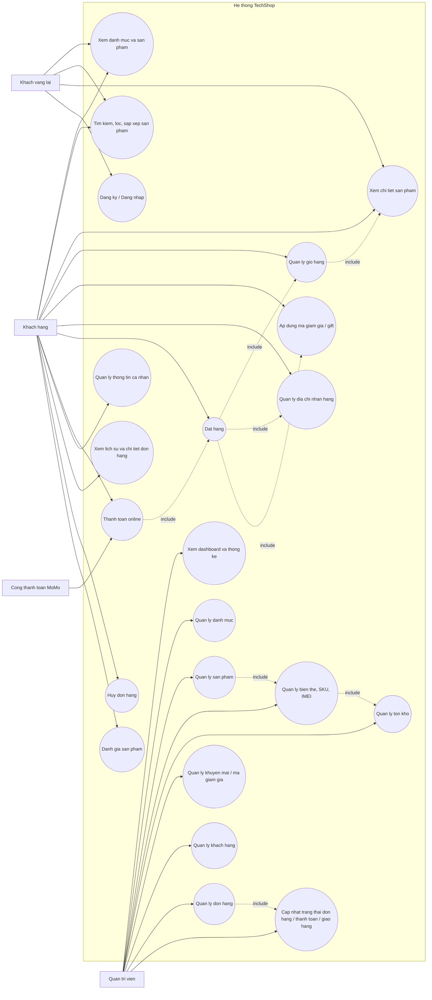

# TechShop Use Case Diagram

Use the Mermaid block below in Markdown preview or Mermaid Live Editor.

## Main actors

- `Khach vang lai`: xem san pham, tim kiem, xem chi tiet, dang ky/dang nhap.
- `Khach hang`: mua hang, quan ly gio hang, dia chi, dat hang, thanh toan, theo doi don, danh gia.
- `Quan tri vien`: quan ly danh muc, san pham, bien the, IMEI, ton kho, khach hang, khuyen mai, don hang.
- `Cong thanh toan MoMo`: xu ly thanh toan online.

## Notes

- Diagram is based on the current `client`, `admin`, and `server` features in this repo.
- If needed, I can convert this into `PlantUML`, `draw.io`, or a cleaner report-ready image.
